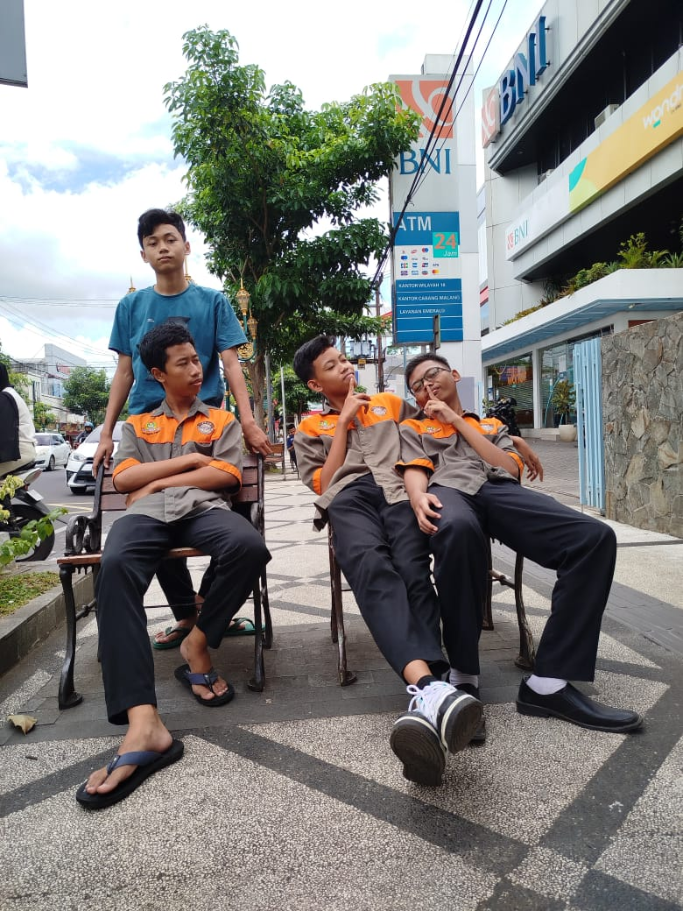
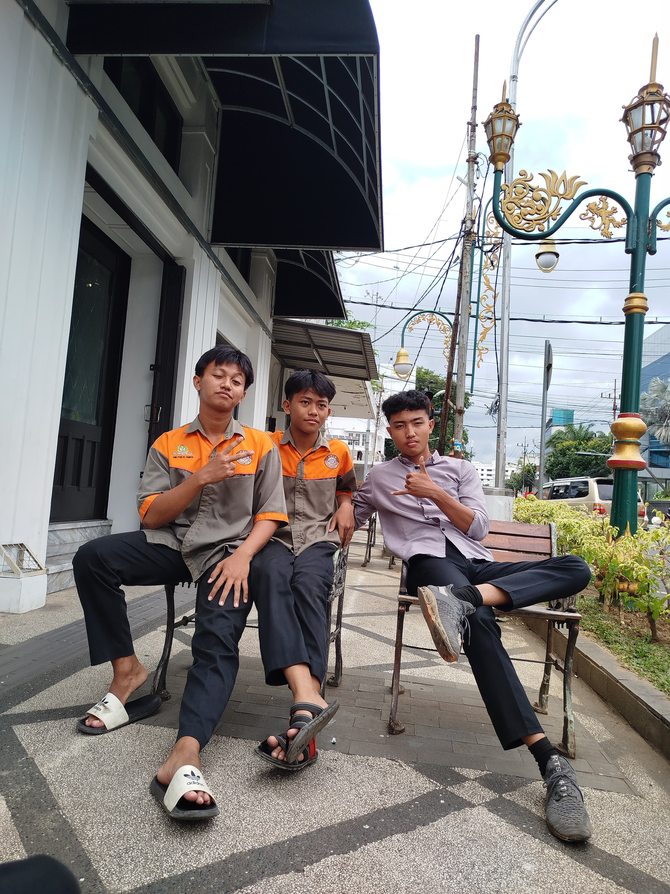

<p align="center">
  
  
</p>


<h1 align="center">SMK PRIMA TOPUPGAME</h1>

<p align="center">
  A modern and responsive digital game top-up platform built with Laravel, TailwindCSS, and modern web technologies.
</p>

---

### Team Members

| Name              | Role               | GitHub Profile                                         |
|-------------------|--------------------|--------------------------------------------------------|
| Almas Tegar St    | Frontend Developer | [@ACreation](https://github.com/ACreatioon)            |
| Ghani Najmud Ts.  | Backend Developer  | [@mefromindonesia](https://github.com/mefromindonesia) |
| Moch Choirul Faiz | UI/UX Designer     | [@Fizz-Fullstack](https://github.com/Fizz-Fullstack)   |
| Surya Budi Kusuma | QA Tester          | [@lil-bro](https://github.com/lil-bro)                 |

> 🔧 **Experience**: 1+ Years Programmer

---

## ⚙️ Technologies & Tools

<table>
  <tr>
    <td align="center" width="96">
      <br>Laravel
    </td>
    <td align="center" width="96">
      <br>Tailwind
    </td>
    <td align="center" width="96">
      <br>PHP
    </td>
    <td align="center" width="96">
      <br>MySQL
    </td>
    <td align="center" width="96">
      <br>Git
    </td>
    <td align="center" width="96">
      <br>GitHub
    </td>
  </tr>
</table>

---

## Features

- Fast, secure digital top-up system
- Product list by game category
- Integration with payment gateways (Xendit, QRIS, etc.)
- Video preview for each product (e.g. gameplay or tutorial)
- Mobile-first responsive UI
- Authentication and order tracking system

---

## Installation

```bash
# 1. Clone the repository
git clone https://github.com/smkprima/topupgame.git
cd topupgame

# 2. Install dependencies
composer install
npm install && npm run dev

# 3. Setup environment
cp .env.example .env
php artisan key:generate

# 4. Run migrations and seeders
php artisan migrate --seed

# 5. Start development server
php artisan serve
